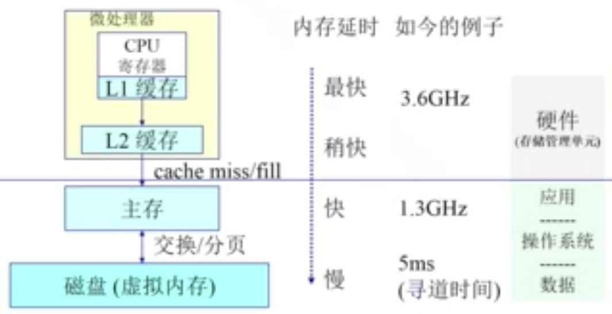

# 计算机基础

> 无论在任何行业、任何领域，所谓的“理解”，其实就是能透过现象看到本质。

计算机基础知识能帮我们了解计算机的本质、编程的本质。

我们为何一定要知道它的本质呢，又不是不能用？—— **因为只有了解了本质，这个东西才能是我们认知范围之内的，才不会让我们觉得有多神秘**。我们是这个行业的从业者，我们不应该觉得自己做的是一件很神秘的工作。

## 计算机组成原理

计算机就是一个电子设备，但为啥它能执行运算呢？基本原理是什么？

PS：了解基本原理并不等同于知道实现方案和细节。例如，我虽然造不出一个汽车发动机，但它的原理就是汽油燃烧带动气缸运动，它并不神秘。

### 是什么

计算机组成原理，一是讲解组成部分，而是讲解存储、运算的原理。

我们编写的代码最终要在计算机上运行，而运行的本质其实就是一个一个的算数或者逻辑运算。而计算机说到底是一个电子设备，计算机组成就是讲解这些算数、逻辑运算，是如何在电子设备上实现的，即讲解程序执行的最底层原理。其中主要包括：

- 计算机的主要组成部分：输入、输出、存储、控制、运算，以及他们的实现原理和依赖关系
- CPU 如何集结这些部分来完成运算

另外，计算机组成原理是计算机理论体系的第一门课，我们还要知道它和其他课程的关系。如下图

### 主要内容

计算机组成原理的内容非常多，都值得看一看。作为程序员，我列一下对我有帮助的内容。如有遗漏，欢迎各位[继续补充](https://github.com/wangfupeng1988/what-is-fe)。

#### 冯.诺依曼 结构

图灵机是一个计算机的理论模型，而 冯.诺依曼 结构是图灵机的具体实现。冯.诺依曼 被誉为“现代计算机之父”。

“冯.诺依曼 结构”最核心的几个理念（现在大家习以为常，但在当时看来可能是颠覆性的）：

- 计算机的组成部分：运算器 控制器 存储器 输入设备 输出设备
- 程序和数据一样，被计算机存储起来，而不是靠人工插拔开关来控制程序，那样效率太低
- 内部计算使用二进制，而非十进制。其实此前有人设计出计算机使用十进制，不过很快就被淘汰了

#### 使用二进制存储

计算机中所有的信息，无论是代码、数据、文档、视频等，在计算机中都是二进制格式的存在。

计算机为何“喜欢”二进制？这个应该很容易理解。计算机是一个电子设备，电路元件的最简单状态变化就是开关。通过电子元件的开关就可以表示 1 和 0 ，这样数据就能存储了，另外通过电子设备的开关控制电路就能很容易的实现逻辑运算，而二进制的所有算数运算，都可以通过逻辑运算来实现。这就是二进制在计算机中简单的原因。

#### 算数运算和逻辑运算

无论你写的程序有多么庞大和复杂，最终计算机执行的时候就是一堆二进制数字，因此只要有算数运算和逻辑运算的能力，就能满足一起的计算需求。即，你能用编程语言写出来的所有逻辑，都可以转换为二进制的算数和逻辑运算。

继续。又因为是二进制存储，所以所有的算数运算都可以转换为逻辑运算。**即，二进制的算数运算，都可以转换为逻辑运算，重要！**

所以，这么一来，计算机在硬件层面只需要实现基本的逻辑运算，外加二进制格式存储，就能实现所有的计算要求。可以看出，复杂、强大的东西，背后的规则都是很简单的，否则它做不了那么强大。

基本逻辑运算有：

- “非”门
- “与”门（用“与非门”和“非门”相连以构成“与门”，因为“与非门”实现更加简单）
- “与非”门
- “或”门
- “异或”门（使用“与 或 非”组合出来）

#### 存储器的区别

“冯.诺依曼结构”中指的存储器通常指内存，但是内存的访问速度远远低于 CPU ，因此现代计算机还有一个高速缓存机制。而且高速缓存也可能有多级，为何要用多级呢？—— 因为越是存取速度快的，成本越高。

所以，要综合考虑使用效率和制作成本，针对不同层级的应用，要使用不同的存储器。如果仅是考虑效率，最终设计出造价很高的计算机，也没人买得起。

### 如何学习

有一本同名的书《计算机组成原理》，很厚，看起来估计也会很枯燥，我没看过。

我看过一个视频教程[《计算机组成原理》](https://www.bilibili.com/video/av9647631/?p=1)（陆俊林，北京大学），感觉不错，推荐给大家。时长很长，一定要静下心来慢慢的看完。

## 操作系统

## 汇编语言

指令（可参考计算机组成部分）

## 编译原理

## 计算机网络

## 编码
