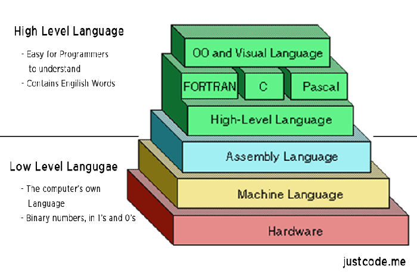

> 无论在任何行业、任何领域，所谓的“理解”，其实就是能透过现象看到本质。

计算机基础知识能帮我们了解计算机的本质、编程的本质。

PS：了解基本原理并不等同于知道实现方案和细节。例如，我虽然造不出一个汽车发动机，但它的原理就是汽油燃烧带动气缸运动，它并不神秘。

我们为何一定要知道它的本质呢，又不是不能用？—— **因为只有了解了本质，这个东西才能是我们认知范围之内的，才不会让我们觉得有多神秘**。我们是这个行业的从业者，我们不应该觉得自己做的是一件很神秘的工作。

最后，计算机原理的内容非常多，我们没必要全部熟悉细节（那样工作量太大了），只了解一些大概即可 —— 2/8 原则。

# 计算机组成原理

计算机就是一个电子设备，但为啥它能执行运算呢？基本原理是什么？

我们编写的代码最终要在计算机上运行，而运行的本质其实就是一个一个的算数或者逻辑运算。而计算机说到底是一个电子设备，计算机组成就是讲解这些算数、逻辑运算，是如何在电子设备上实现的，即讲解程序执行的最底层原理。其中主要包括：

- 计算机的主要组成部分：输入、输出、存储、控制、运算，以及他们的实现原理和依赖关系
- CPU 如何集结这些部分来完成运算

我看过一个视频教程[《计算机组成原理》](https://www.bilibili.com/video/av9647631/?p=1)（陆俊林，北京大学），感觉不错，推荐给大家。时长很长，需要耐心看完。

# 操作系统

操作系统 OS - 连接硬件和软件。对于大部分程序员，你写的所有代码，最终都会基于操作系统来运行，而不会直接触碰硬件。

操作系统的主要工作：

- 对上层，要管理各个应用软件
    - 管理应用程序，如限制其占用太多内存
    - 为应用程序提供服务，如 IO 网卡 声卡等
    - 杀死应用程序
- 对下层，要管理计算机的各个硬件资源，**对其主要模块做抽象**（理解这一点很重要！），本文就围绕着这三个抽象来做总结。
    - CPU 抽象为进程、线程，以及调度
    - 物理内存抽象为逻辑内存、虚拟内存，并给各个应用程序提供独立的内存空间
    - 硬盘抽象为文件系统，通过文件即可管理硬盘的数据

操作系统的主要特点有：

- 并发：通过调度算法，让多个进程都能同时执行
- 共享：当多个进程同时访问同一数据时，进行管理（同时共享 或者 互斥共享）
- 虚拟：把硬件抽象，让每个应用程序都感觉自己是独占一台计算机，即把一台物理机器虚拟成多台机器

推荐一个视频教程[《操作系统》](https://www.bilibili.com/video/av6538245?from=search&seid=246032312215120374)（向勇、陈渝，清华大学）。时长很长，需要耐心看完。

# 汇编语言

汇编语言，人类最早的编程语言，也是最贴近计算机底层的编程语言。你现在写任何逻辑性代码（如 C C++ java python js 等）最终都会转换成汇编语言来执行。

通过计算机组成原理，我们知道计算机内部的存储（无论是数据还是程序），都是二进制格式。程序是由一个一个的指令组成的，比如加法指令就是 `00000011` ，这些指令发送给 CPU 完成计算。

如果用二进制来编写程序，对于人来来说可读性太差了。能不能用一个已读一点的符号，来代替这一个一个的二进制指令呢？—— 这个就是汇编语言。简答来说，汇编语言就是机器语言（二进制代码）的助记符，是最早的语法糖。

了解程序是在计算机中是如何被执行的，即透过现象（高级语言）看本质 —— 这是所有领域的技术人员都应该追求的东西。那些能随意在 php java js C++ 等语言中随意切换的程序猿大牛，我想他肯定熟知这个本质。

无论你日常编写的语言多么高级，肯定最终经过转换（编译原理的内容）然后生成汇编语言这种最底层的语言，再被计算机执行。而“执行”的本质，就可以通过汇编语言的一行一行代码看出：使用了哪个指令、获取了哪个内存地址、操作了哪个内存片段或者寄存器……

另外一个重要的部分就是程序执行的时候的内存模型。一段程序拿过来，哪些变量将被放在栈 stack ，哪些变量将被放在堆 heap ？以及这些内存空间如何被释放？甚至是你日常遇到的爆栈、内存泄露等问题，了解了内存模型，这些都会变的非常具象，不再懵。

推荐大家去阅读阮一峰的 [汇编语言入门教程](http://www.ruanyifeng.com/blog/2018/01/assembly-language-primer.html) ，通俗易懂。

除了上文阮一峰的教程，还推荐大家去网上搜 **“汇编语言 张悠慧 清华大学”**，一个系列的视频教程。时长很长，需要耐心看完。

# 编译原理

编译，把高级语言转换为底层语言（如汇编语言），才能让计算机最终能执行高级语言。

我们日常写的高级语言（C C++ java python js 等），我们人来读起来是越来越轻松了，但计算机如何识别并执行呢？—— 答案就是：将高级语言转换为汇编语言，然后计算机再执行。这个转换的过程，就是编译。

执行编译工作的，成为编译器。所以编译原理，也就是编译器的工作原理。编译器的基本定义是：将一门语言转换为另一门语言，一般指将高级语言转换为机器语言，但仅仅是转换并不执行。编译器最基本的底线，就是保证源代码和目标代码的语义相同。

编译在前端也有应用。如 babel 内部使用的 [babylon](https://www.npmjs.com/package/babylon) ，就是一个编译器，将 ES6 转换为 ES5 。
再例如，将 vue 的模板编译为 js 代码，将 React 中的 jsx 编译为 js 代码，这些过程虽然不能成为严格的编译器，但也用到了相似的流程。

推荐一个视频教程，可搜索 **“编译原理 中科大 华保健老师”** ，时长较长，需耐心观看。

# 计算机网络

现在是一个网络时代，大家的工作产出也都是基于网络运转的。那么计算机之前是如何连接的，网络是如何通讯的？—— 作为从业者，我们需要了解一下这个过程。

有一个很经典的面试题“描述从浏览器输入 url 到显示出网页的整体过程”，这其中就涉及到很多计算机网络的知识。所以这不仅仅是理论，还是有一定实际价值的。

推荐大家阅读《图解 HTTP》《图解 TCP/IP》《网络是怎么连接的》这些书。看完会对这部分有一些了解。

# 编码

计算机只能处理二进制数据，从计算机被发明出来它是这样，到现在还是这样。那么我们要让这个只能识别 `010101...` 二进制的家伙去处理文字，该怎么办呢？—— 把文字用二进制表示，例如用 `1000001` 表示字母 `A` 。

但是，世界上的文字这么多，英文还算比较简单，还有很多复杂的文字，如中文、日文、拉丁文、emoji 表情，这么多文字得有一定的规则，否则就乱了。所有就有了我们常见的 ASCII 码、unicode 字符集、UTF-8 、UTF-16 等。

推荐大家阅读《编码隐匿在计算机软硬件背后的语言》。

# 总结

以上就是计算机基础的所有知识范围，而且全部都是程序员需要了解的基础知识，是未来进阶的基础。

内容比较多，可以慢慢的看，这也不是看完了就立马能出效果的事情，是修炼内功。
